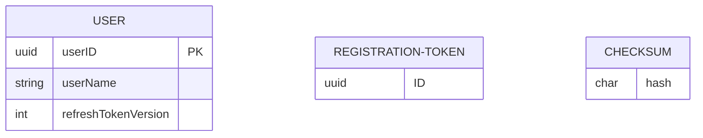

```mermaid
erDiagram
    USER {
        uuid userID PK
        string userName
        int refreshTokenVersion
    }
    REGISTRATION-TOKEN {
        uuid ID
    }
    CHECKSUM {
        char hash
    }
```
